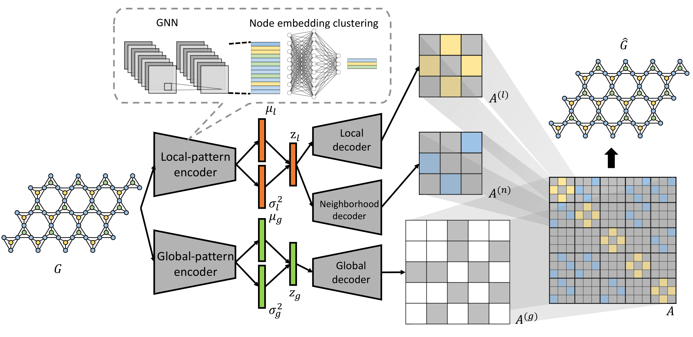

# This is the official Pytorch implementation of [Deep Generative Model for Periodic Graphs](https://arxiv.org/pdf/2201.11932.pdf) accepted by NeurIPS 2022:
```
@article{wang2022deep,
  title={Deep Generative Model for Periodic Graphs},
  author={Wang, Shiyu and Guo, Xiaojie and Zhao, Liang},
  journal={arXiv preprint arXiv:2201.11932},
  year={2022}
}
```
The code for PGD-VAE is adapted from the code of GRAN: [Efficient graph generation with graph recurrent attention networks](https://github.com/lrjconan/GRAN).



## Running environment:
Python 3.9; PyTorch 1.8.1, networkx 2.5, scipy, numpy, pyyaml

## Datasets
1. Data: QMOF, MeshSeg and synthetic datasets have been processed and provided in the repository as: 

- QMOF: MOFGraphs.p, MOFUnitCells.p
- MeshSeg: MeshSeqGraphs.p, MeshSegUnitCells.p
- Synthetic: SynGraphs.p, SynUnitCells.p

2. To download the original datasets:

- Original QMOF data can be downloaded from [here](https://github.com/arosen93/QMOF).
- Original MeshSeg data can be downloaded from [here](https://segeval.cs.princeton.edu/).
- Synthetic data is synthesized manually by the paper.

3. The code to extract and generate data from original QMOF and MeshSeg datasets have been provided in the package as:

- QMOF: MOFDataGen.py
- MeshSeg: MeshSegDataGen.py

## Arguments of code：
1. data = {synthetic, mesh, qmof}
2. lr: learning rate
3. epoch: epochs
4. train = {True, False}
5. eval = {True, False}

## Training the model

### To train the model using synthetic data and 100 epochs with learning rate of 0.001:

```python train.py --data synthetic --train True --epoch 100 --lr 0.001```

### Note：
1. The trained model will be saved as "{data}_train.pt" in the working directory.
2. The default dataset to be trained is the synthetic dataset. To train the model on another datasets please specify the dataset after ```--data``` argument.
3. To train the model with different penalties on KL divergence terms, please manually modify the code in ```model.py``` , line 293.

## Evaluating the model

### To evaluate trained model:
```python train.py --data synthetic --train False --eval True```

### Note:
1. Functions for evaluation purpose are wrapped up in evaluation.py:
- compute_kld(): degree, cluster, orbit
- check_uniqueness(): uniqueness
- novelty_metric(): novelty
